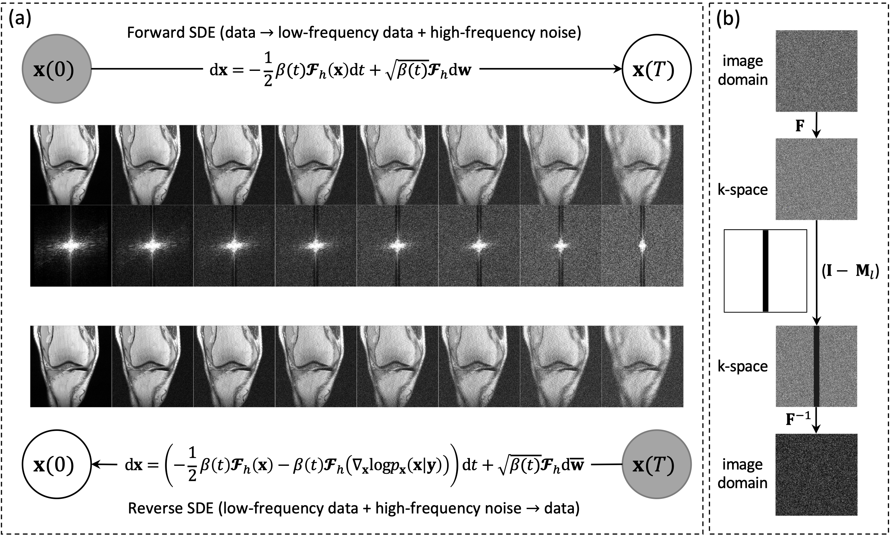

<h1 align="center">High-Frequency Space Diffusion Model for Accelerated MRI</h1>
<p align="center">
    <a href="https://arxiv.org/pdf/2208.05481.pdf"></a>
    <!-- <a href=""></a> -->
    <a href="https://ieeexplore.ieee.org/document/10385176/">  </a>
</p>

Official code for the paper "[High-Frequency Space Diffusion Model for Accelerated MRI](https://ieeexplore.ieee.org/document/10385176)", published in TMI 2024.


by [Chentao Cao*](https://scholar.google.com/citations?user=vZPl_oQAAAAJ&hl=en), [Zhuo-Xu Cui*](https://scholar.google.com/citations?user=QZx0xdgAAAAJ&hl=en), Yue Wang*, Shaonan Liu, Taijin Chen, [Hairong Zheng](https://scholar.google.com/citations?user=gcRVqJsAAAAJ&hl=zh-CN), [Dong Liang](https://scholar.google.com/citations?user=3cAJWoIAAAAJ&hl=en), and [Yanjie Zhu<sup>+</sup>](https://scholar.google.com/citations?user=X2mIoQ4AAAAJ&hl=en)(*denotes equal contribution, <sup>+</sup>denotes corresponding author).


### Illustration


### Abstract
Diffusion models with continuous stochastic differential equations (SDEs) can serve as a deep generative prior to solving the inverse problem in magnetic resonance (MR) reconstruction. However, low-frequency regions of k-space data are typically fully sampled in fast MR imaging, while existing diffusion models are performed throughout the entire image or k-space, inevitably introducing uncertainty in the reconstruction of low-frequency regions. Additionally, existing diffusion models often demand substantial iterations to converge, resulting in time-consuming reconstructions. To address these challenges, we propose a novel SDE tailored specifically for MR reconstruction with the diffusion process in high-frequency space (referred to as HFS-SDE). This approach ensures determinism in the fully sampled low-frequency regions and accelerates the sampling procedure of reverse diffusion. Experiments conducted on the publicly available fastMRI dataset demonstrate that the proposed HFS-SDE method outperforms traditional parallel imaging methods, supervised deep learning, and existing diffusion models in terms of reconstruction accuracy and stability. The fast convergence properties are also confirmed through theoretical and experimental validation. 

## Adv
Checkout our
- 🔥🔥🔥 TMI'24 Work [SPIRiT-Diffusion](https://github.com/zhyjSIAT/SPIRiT-Diffusion), by employing an optimization model in MRI, we guide the formulation of forward and reverse diffusion equations with inherent physical significance. This process facilitates the reconstruction of MR images or the completion of missing k-space data under imposed physical constraints.

## Setup

The following will introduce environment setup, data preparation, usage instructions, experiment weights, and a quick start guide. In the quick start guide, we provide experiment weights and synthetic data for easy model validation without the need for lengthy data downloads. Additionally, the quick start guide will offer guidance on parameter settings for generating high-quality reconstruction samples.

### Dependencies

Run the following to install a subset of necessary python packages for our code.

```sh
conda env create -f environment.yml
```

* `Note`: if your CUDA version is lower than 11.6, you may check on the ```freeinstall.sh```. In this shell script, we provide all of Python packages we needed. 

## Data Preparation

### Phantom dataset

To facilitate a quick start, we provide sample data located at `data/photom`.

### fastMRI dataset

#### Download

For the training dataset, we used 973 individuals from the fastMRI multi-coil knee dataset. A total of 28904 T1- and T2-weighted images were finally involved in the training dataset. We selected two datasets for testing. One was the knee data from 3 individuals(file1000976.h5, file1001064.h5, and file1001077.h5) selected randomly from knee_multicoil_val (approximately 93.8 GB) dataset, and the other one was the brain data from 1 individual(file_brain_AXT2_200_2000019.h5).

These datasets can be downloaded [here](https://fastmri.med.nyu.edu/).

#### Preprocess

In the image domain, crop the data to 320x320 and perform sensitivity estimation using the [BART](https://mrirecon.github.io/bart/) toolbox. The Auto-Calibration Signal(ACS) region is set to 24x24.

##### Sensitivity Estimation Workflow

* `Sensitivity Estimation:` We employ the  [BART](https://mrirecon.github.io/bart/) toolbox to estimate the sensitivity maps for the raw data(h5 files downloaded [above](#Download)). The ACS region for this estimation is set to 24x24 pixels.
- The sensitivity maps are essential for parallel imaging techniques, such as parallel MRI (magnetic resonance imaging), to improve image reconstruction by accounting for the sensitivity of each coil element.
* `Code Location:` You can find the code for sensitivity estimation in the `data_prepare/generate_smaps_phantom.py` and `data_prepare/generate_smaps_fastMRI.py`.

Please ensure that you have the necessary libraries and tools, including [BART](https://mrirecon.github.io/bart/), installed and configured to perform these operations on your data.

##### Data Slice Saving

Since fastmri dataset is too large, we save its index as a `pkl` file for quick loading.

- The code for generating this `pkl` file is in `data_prepare/save_data_slice.py`. Execute the script to save data slices.

### Mask Preparation

- The code for generating undersampling mask is in `utils\generate_mask.py`.
- The low-frequency mask and undersampling masks are provided in `mask\`.

## Usage

Train and evaluate our models through `main.py`.

```sh
main.py:
  --config: Training configuration.
    (default: 'None')
  --mode: <train|sample>: Running mode: train or sample
  --workdir: Working directory
```

* `config` is the path to the config file. Our prescribed config files are provided in `configs/`. They are formatted according to [`ml_collections`](https://github.com/google/ml_collections) and should be quite self-explanatory.

  **Naming conventions of config files**: the path of a config file is a combination of the following dimensions:

      config
      ├── ve
      │   └── ddpm_continuous.py
      ├── vp
      │   └── ddpm_continuous.py
      └── hfssde
          └── ddpm_continuous.py

  *  method: One of `ve`, `vp`, `hfssde`, corresponding to VE-SDE, VP-SDE, HFS-SDE, respectively.
  *  model: One of `ncsnpp`, `ddpm`.
  *  **Note that we use `ddpm_continuous.py` in all experiments(hfssde, vpsde, and vesde).**

* `workdir` is the path that stores all artifacts of one experiment, like checkpoints, samples, and evaluation results.

* `mode` is either "train" or "sample". When set to "train", it starts the training of a new model. When set to "sample", it can do an arbitrary combination of the following

  * In this process, MRI reconstruction is performed on undersampled k-space data, and the following metrics are computed: NMSE (Normalized Mean Squared Error), PSNR (Peak Signal-to-Noise Ratio), and SSIM (Structural Similarity Index). The results are saved at the path `results/model_name`.


## Pretrained checkpoints

All checkpoints are provided [here](https://drive.google.com/drive/folders/12QjFb3HREdfLFWIgyrot4rXiBOFlOxH5?usp=drive_link).

## Quick Start Guide

### Training

We provided the training script `train_fastMRI.sh` , just as Usage provided. 

Navigate to the default configuration file located at `configs\default_fastMRI_configs.py`.

- In this file, modify the following parameters:`training.epochs`, `optim.lr`, `config.training.batch_size`. Adjust `config.training.batch_size` according to your GPU memory capacity.
- It's worth noting that we have not made any changes to these parameters in our publicly available experiment weight training.

To make changes to the configuration file, `configs\hfssde\ddpm_continuous.py`, follow these steps and adjust the following parameters:

- Open the configuration file located at `configs\hfssde\ddpm_continuous.py`.

- Set the following parameters with their respective meanings based on the table below:

| Parameter            | Meaning                                   | Example Value                                         |
| -------------------- | ----------------------------------------- | ----------------------------------------------------- |
| `training.mask_type` | Type of data undersampling mask           | `low_frequency` (if 1D-sample),`center`(if 2D-sample) |
| `training.acc`       | Acceleration factor for undersampling     | `4` or every positive value                           |
| `training.acs`       | Auto-Calibration Signal (ACS) region size | `24` or every positive value                          |

Please update these parameters in the configuration file according to your requirements.

**Note:** Make sure that the relative mask exists. check your `mask` dir, the mask name rule is followed next:

```
training.mask_type + _length + training.acs + .mat
```

Run the next code to train your model.

```sh
bash train_fastMRI.sh hfssde
```

- `hfssde` is one of the choices; you can replace it with another parameter, such as `vesde` or `vpsde`.

- If you just want to apply our model, you have a better choice in using our checkpoint. Please download our checkpoint and start to sample or reconstruct the MRI image.

### Sampling

We prepare to apply our model and use phantom data referred to below to reconstruct a high-quality image.

**Note:** Please make sure that you download the checkpoint or you have trained a model.

- Open the configuration file located at `configs\hfssde\ddpm_continuous.py`.
- Set parameters related to undersampling: `sampling.mask_type`, `sampling.acc`, `sampling.acs`. Make sure that the related mask exists.
- If you want to speed up the sampling process, you should also adjust the settings for `sampling.N` and `sampling.accelerated_sampling`.
- Set sampling parameters in the the table below:

| Parameter                | Meaning                                                      | Example Value      |
| ------------------------ | ------------------------------------------------------------ | ------------------ |
| `sampling.snr`           | Adjust SNR: Higher values mean more noise, lower values mean more undersampling artifacts | between 0 and 1    |
| `sampling.mse`           | Control the overall error of the predictor, where a larger value increases the weight of the score. | non-negative value |
| `sampling.corrector_mse` | Control the overall error of the corrector, where a larger value gives more weight to the score. | non-negative value |
| `sampling.N`             | Set the sampling steps to a lower value to accelerate the sampling process. | positive integer   |
| `sampling.accelerated_sampling` | Enable accelerated sampling to improve speed. Set to 'true' for faster sampling. | 'true' or 'false'  |


- Execute the following code.

```sh
bash test_fastMRI.sh hfssde
```

### Tuning Guidelines:

#### Training

- Note: Due to the limitation of computational resources, the pre-training weights we provide are all 190 epochs. We believe that a larger training epoch can further improve the performance of the model


#### Sampling

- After reconstruction, examine the corresponding image.
- If there are artifacts, increase the `sampling.snr` value.
- If the image appears blurry or has excessive noise, decrease the `sampling.snr` value.
- If the reconstruction quality is good but there's a global brightness issue, adjust `sampling.corrector_mse` or `sampling.mse` values.
- For `sampling.snr`, we recommend trying values in increments of 0.1, using 0.01 or 0.02 as step intervals for a greedy search.
- For `sampling.corrector_mse` or `sampling.mse` values, no exact solution is required. Use an exponential search approach, for example, 0.01, 0.1, 1.0, 10.0...
- If using accelerated sampling, it is recommended to set the value of `sampling.N` to be greater than 100. Setting it below 100 will result in poor image quality.


These guidelines will help you fine-tune the parameters effectively.


## References

If you find the code useful for your research, please consider citing

```bib
@article{cao2024hfs,
  author={Cao, Chentao and Cui, Zhuo-Xu and Wang, Yue and Liu, Shaonan and Chen, Taijin and Zheng, Hairong and Liang, Dong and Zhu, Yanjie},
  journal={IEEE Transactions on Medical Imaging}, 
  title={High-Frequency Space Diffusion Model for Accelerated MRI}, 
  year={2024},
  volume={43},
  number={5},
  pages={1853-1865},
  doi={10.1109/TMI.2024.3351702}}
```

Our implementation is based on [Score-based SDE](https://github.com/yang-song/score_sde_pytorch) by Dr. Yang Song. And we also borrowed some code from [csgm-mri-langevin](https://github.com/utcsilab/csgm-mri-langevin). Thanks for their great works!

## Questions
If you have any problem, please contact chentaocao1224@gmail.com
